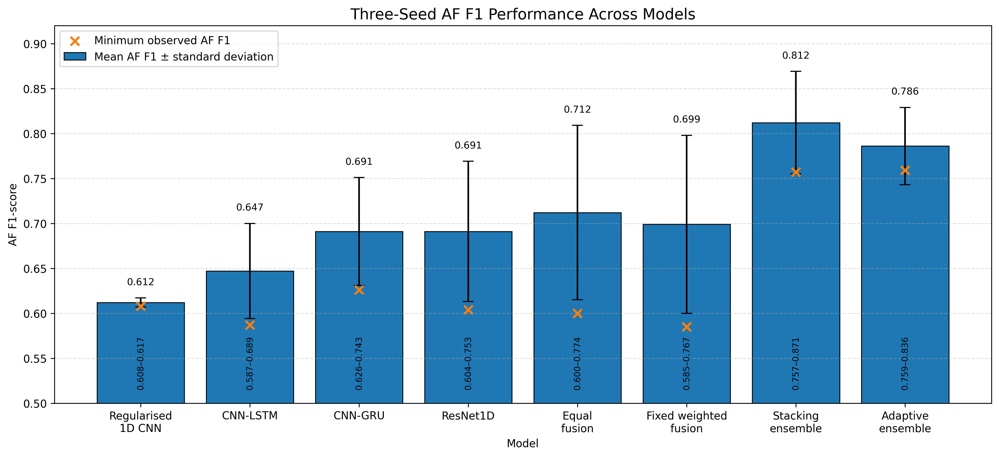
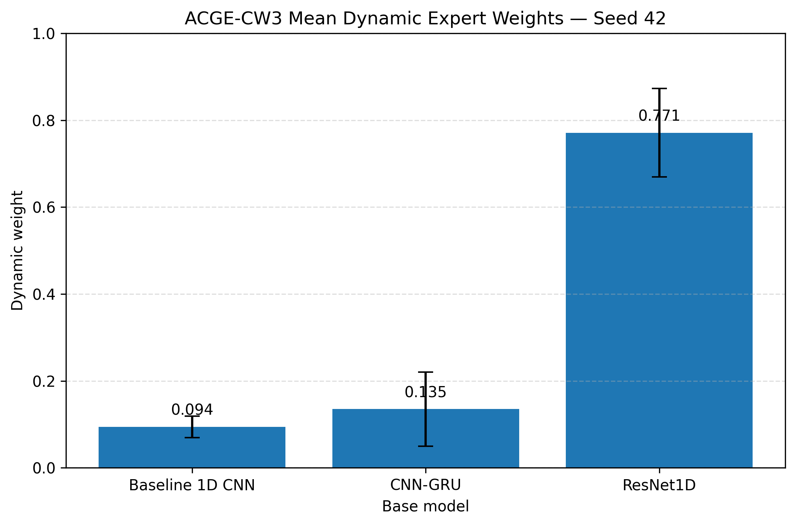
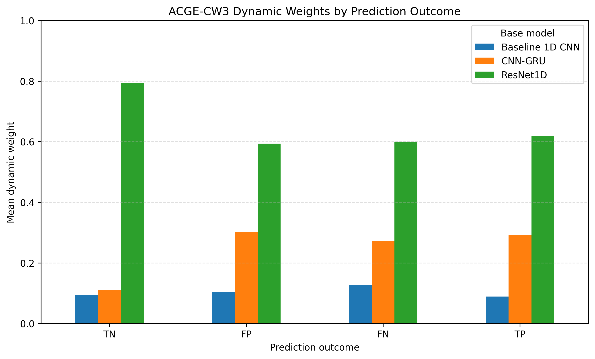
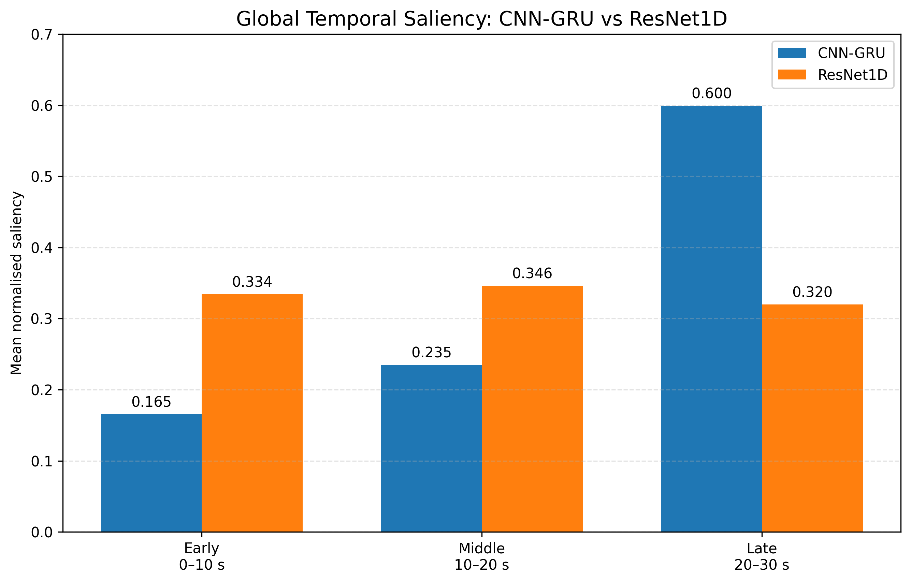

# ECG Atrial Fibrillation Detection

Deep-learning-based atrial fibrillation detection from single-lead ECG signals using the PhysioNet/Computing in Cardiology Challenge 2017 dataset.

This project compares multiple neural architectures, ensemble strategies, and explainability methods for imbalanced atrial fibrillation (AF) classification. It also includes an Adaptive Confidence-Guided Ensemble (ACGE), which learns sample-specific weights over multiple base models.

## Dataset

The experiments use the PhysioNet/CinC Challenge 2017 single-lead ECG dataset.

After label filtering and preprocessing:

- 8,244 recordings
- 738 AF samples
- 7,506 Non-AF samples
- Sampling rate: 300 Hz
- Fixed input length: 9,000 samples (30 seconds)
- Per-record z-score normalisation

For the seed-42 split:

- Training: 5,770
- Validation: 1,237
- Test: 1,237

## Models

The following models were evaluated:

- Regularised 1D CNN
- CNN-LSTM
- CNN-GRU
- ResNet1D
- Equal GRU-ResNet fusion
- Fixed weighted fusion
- Logistic-regression stacking
- Adaptive Confidence-Guided Ensemble (ACGE)

## Adaptive Confidence-Guided Ensemble

ACGE combines three frozen base experts:

- Baseline 1D CNN
- CNN-GRU
- ResNet1D

For each ECG sample, a 13-dimensional gating feature vector is constructed from:

- 3 base-model probabilities
- 3 confidence features
- 3 pairwise disagreement features
- 4 probability summary statistics:
  - mean
  - standard deviation
  - maximum
  - minimum

The gating network uses:

```text
13-D input
   ↓
Dense(16, ReLU)
   ↓
Dropout(0.20)
   ↓
Dense(8, ReLU)
   ↓
Softmax(3)
   ↓
Sample-specific expert weights
```

The final AF probability is:

\[
p = w_1p_1 + w_2p_2 + w_3p_3
\]

where \(p_i\) is the AF probability produced by each base expert and \(w_i\) is the corresponding sample-specific dynamic weight.

## Results

### Three-seed Model Comparison

The following figure summarises AF F1 performance across seeds 42, 52, and 62.



Full numerical results are available in:

[`results/model_comparison_three_runs.csv`](results/model_comparison_three_runs.csv)

### Seed-42 Comparison


The seed-42 comparison shows the trade-off between AF F1, AF recall, and ROC-AUC across the evaluated architectures and ensemble strategies.

## Final Fixed-CW3 ACGE Result

The final fixed seed-42 ACGE configuration used:

- Non-AF class weight: 1
- AF class weight: 3
- Classification threshold: 0.65

Held-out test performance:

| Metric | Value |
|---|---:|
| Accuracy | 0.9499 |
| AF Precision | 0.6644 |
| AF Recall | 0.8818 |
| AF F1 | 0.7578 |
| Non-AF F1 | 0.9720 |
| Macro F1 | 0.8649 |
| Specificity | 0.9565 |
| ROC-AUC | 0.9742 |

Confusion matrix:

```text
TN = 1078
FP = 49
FN = 13
TP = 97
```

Full result:

[`results/acge_seed42_final.csv`](results/acge_seed42_final.csv)

## Dynamic Expert Weights

The fixed-CW3 ACGE learned sample-specific expert weights.



Mean expert weights across the seed-42 test set:

| Base model | Mean weight |
|---|---:|
| Baseline 1D CNN | 0.094 |
| CNN-GRU | 0.135 |
| ResNet1D | 0.771 |

The model relied most heavily on ResNet1D overall, while still adjusting the contribution of each expert on a sample-by-sample basis.

Outcome-specific dynamic weights are shown below:



## Explainability

The project uses multiple explainability methods:

- Saliency
- SmoothGrad
- SHAP
- LIME

Attribution values were aggregated into 1-second ECG segments to study temporal importance.

### CNN-GRU vs ResNet1D



The CNN-GRU showed stronger attribution concentration in the late 20-30 second ECG region, while ResNet1D exhibited a more balanced temporal distribution across early, middle, and late regions.

### CNN-GRU XAI

- SHAP:  
  [`results/figures/xai/cnn_gru/cnn_gru_selected_samples_reference_shap_comparison.png`](results/figures/xai/cnn_gru/cnn_gru_selected_samples_reference_shap_comparison.png)

- LIME:  
  [`results/figures/xai/cnn_gru/cnn_gru_selected_samples_lime_comparison.png`](results/figures/xai/cnn_gru/cnn_gru_selected_samples_lime_comparison.png)

- Dominant temporal region:  
  [`results/figures/xai/cnn_gru/cnn_gru_full_test_dominant_region_percentage.png`](results/figures/xai/cnn_gru/cnn_gru_full_test_dominant_region_percentage.png)

- Late-region saliency:  
  [`results/figures/xai/cnn_gru/cnn_gru_full_test_late_saliency_boxplot.png`](results/figures/xai/cnn_gru/cnn_gru_full_test_late_saliency_boxplot.png)

### ResNet1D XAI

- Saliency:  
  [`results/figures/xai/resnet1d/resnet1d_selected_samples_segment_comparison.png`](results/figures/xai/resnet1d/resnet1d_selected_samples_segment_comparison.png)

- SmoothGrad:  
  [`results/figures/xai/resnet1d/resnet1d_selected_samples_smoothgrad_comparison.png`](results/figures/xai/resnet1d/resnet1d_selected_samples_smoothgrad_comparison.png)

- SHAP:  
  [`results/figures/xai/resnet1d/resnet1d_selected_samples_reference_shap_comparison.png`](results/figures/xai/resnet1d/resnet1d_selected_samples_reference_shap_comparison.png)

- LIME:  
  [`results/figures/xai/resnet1d/resnet1d_selected_samples_reference_lime_comparison_aligned.png`](results/figures/xai/resnet1d/resnet1d_selected_samples_reference_lime_comparison_aligned.png)

## Project Structure

```text
ecg-af-detection/
├── src/
│   └── ecg_af/
│       ├── __init__.py
│       ├── models.py
│       ├── evaluation.py
│       └── acge.py
├── tests/
│   ├── test_acge.py
│   ├── test_evaluation.py
│   └── test_models.py
├── results/
│   ├── model_comparison_three_runs.csv
│   ├── acge_seed42_final.csv
│   └── figures/
│       ├── performance/
│       ├── acge/
│       └── xai/
├── notebooks/
├── pyproject.toml
├── .gitignore
└── README.md
```

## Installation

Install the project in editable mode:

```bash
python -m pip install -e ".[dev]"
```

## Testing

Run the complete test suite:

```bash
python -m pytest
```

Current tests cover:

- ACGE gating-feature construction
- preservation of base-model probabilities
- ACGE probability output range
- balanced class-weight calculation
- threshold tuning
- binary classification metrics
- specificity calculation
- output validation for the implemented neural architectures

At the current stage, all 12 tests pass.

## Reproducibility

Experimental seeds:

```text
42
52
62
```

The original experiments used TensorFlow with GPU acceleration.

Large datasets, trained model checkpoints, and generated binary artifacts are excluded from the repository.

## Experimental Note

The three-seed adaptive-ensemble comparison used automatically balanced class weights.

The final fixed-CW3 seed-42 experiment is reported separately and used:

```text
AF class weight = 3
classification threshold = 0.65
```

These two adaptive-ensemble settings are therefore reported separately rather than treated as the same repeated experiment.